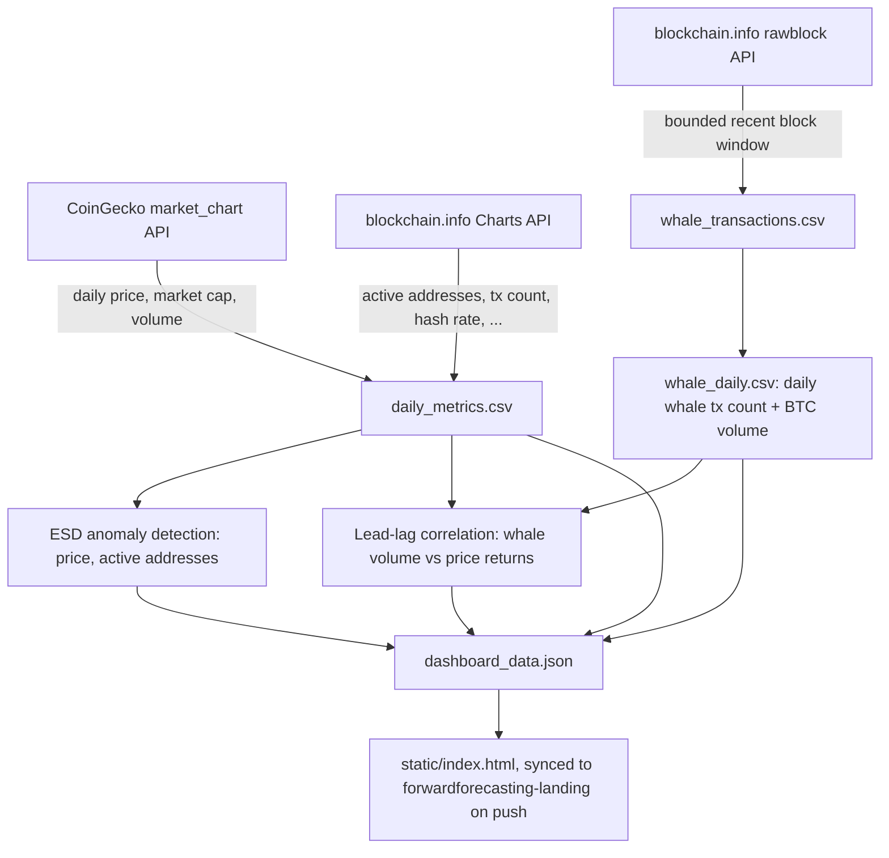

# Blockchain Analytics

Bitcoin on-chain trend and whale-influence analytics: real BTC/USD price and on-chain
fundamentals, a real (bounded-window) scan of whale transactions straight from recent
Bitcoin blocks, a generalized ESD anomaly detector, and an honest lead-lag correlation
test between whale activity and price returns.

**Live demo:** https://www.forwardforecasting.eu/blockchain-analytics/

Inspired by a prior personal analysis project covering on-chain insights and
event detection (Bitcoin BigQuery insights, anomaly/event detection on on-chain time
series, address labeling). This project reuses the same spirit (and the same
anomaly-detection method, reimplemented) on freely available public APIs instead of a
paid BigQuery dataset, and adds the whale angle: does big-wallet activity actually
lead the price, or not.

## Table of contents

- [Why this exists](#why-this-exists)
- [Data flow](#data-flow)
- [Data sources](#data-sources)
- [Methodology](#methodology)
- [Why statistical methods, not ML](#why-statistical-methods-not-ml)
- [Results](#results)
- [Limitations and what a production version would need](#limitations-and-what-a-production-version-would-need)
- [Repository layout](#repository-layout)
- [Running it yourself](#running-it-yourself)
- [Cost](#cost)

## Why this exists

This is a demonstrator built to show what a rigorous, honest on-chain analytics project
looks like: real data pulled from real public sources (not a synthetic dataset dressed
up to look real), a well-understood statistical method applied correctly instead of an
opaque model, and a plainly-stated answer to the interesting question ("do whales move
the market?") even when that answer is "not clearly, with this much data" rather than a
confident headline.

## Data flow



## Data sources

All sources are free, require no API key, and are directly scriptable, the same
constraint this project's original inspiration explicitly called out.

| Source | What | Access |
|---|---|---|
| **CoinGecko** | BTC/USD daily price, market cap, trading volume, 1 year | `coins/bitcoin/market_chart` REST endpoint, no auth |
| **blockchain.info Charts API** | Daily on-chain fundamentals: unique active addresses, transaction count, hash rate, miners' revenue, mempool size, estimated on-chain transfer volume | `api.blockchain.info/charts/<metric>`, no auth |
| **blockchain.info rawblock API** | Full block contents (every transaction, every output value) for a real recent window of blocks | `blockchain.info/rawblock/<hash>`, walked backwards via each block's `prev_block` field, no auth |

**Whale window is real but deliberately bounded.** `rawblock` returns an entire block
(all transactions with their output values) in one HTTP call, roughly 6MB per block on
average, which makes it practical to scan every single transaction in a window of
recent blocks rather than sampling. Scanning a full year of blocks this way (~52,000
blocks at 10 minutes each, over 300GB of JSON) is not practical for a demo project, so
the whale dataset covers the most recent ~150 blocks (roughly the last day of real
chain activity) instead, scanned in full, not sampled. This is stated explicitly rather
than silently passed off as a full year of coverage; see Limitations.

**Address labeling (exchange vs. unknown wallet) was scoped out**, deliberately, rather
than shipped with unverified labels. Building a schema and pipeline for known-address
labels from public sources like mining pool lists is real, valuable follow-on work, but
publishing specific "this address belongs to Exchange X" claims without a verified,
sourced label list risks being simply wrong. See "What's next" below.

## Methodology

1. **Daily join.** CoinGecko price/market-cap/volume and blockchain.info's on-chain
   fundamentals are both daily series; they're joined on date into one table
   (`data/processed/daily_metrics.csv`).
2. **Whale detection.** Every transaction in the scanned block window has its total
   output value summed (in BTC) and is flagged as a whale transaction if that total is
   **>= 50 BTC** (roughly a few million USD at current prices). Flagged transactions are
   aggregated into a daily whale count and total BTC volume series.
3. **Event/anomaly detection.** A generalized ESD (Extreme Studentized Deviate) test
   (Rosner, 1983) is run on the residuals of a series against its own 7-day centered
   moving average, applied independently to the price series and the active-addresses
   series. This is a direct reimplementation of an approach the author wrote for a
   prior event-detection exercise, modernized into a small functional module
   (`src/anomaly.py`) instead of the original stateful class.
4. **Whale-influence test.** Daily whale BTC volume is correlated (Pearson and
   Spearman) against same-day and next-few-days BTC price returns, at lags from -3 to
   +3 days, to check whether whale activity leads price moves, lags them, or neither.
   The correlation table and a plain-language, non-overclaiming summary are both baked
   into the dashboard.

## Why statistical methods, not ML

A machine-learning model (say, a classifier predicting "price up/down from whale
features") would be the wrong default here:

- **Not enough data.** A several-hundred-point daily series and a single-day whale
  window are nowhere near enough to train a model that generalizes; it would be fitting
  noise, then a confident-looking but meaningless output.
- **Interpretability matters more than fit.** The entire point of this project is
  showing the actual evidence for or against whale influence. A generalized ESD test
  and a Pearson correlation table are auditable line by line; a model's internal
  "whale influence score" would not be.
- **The honest answer is more valuable than a confident one.** If the correlation is
  weak or not statistically significant given the data available, the dashboard says so
  directly rather than dressing it up. See Results.

## Results

Exact numbers depend on when the pipeline was last run (see the live dashboard for the
current values, refreshed each time `scripts/build_dataset.py` is re-run and pushed).
As of the most recent run:

- Whale scan window, whale transaction count, and total whale BTC volume: see the KPI
  row on the live dashboard.
- Number of ESD-flagged anomalies in price and in active addresses: see the live
  dashboard's price and address charts.
- Lead-lag correlation table and plain-language summary: see the live dashboard's
  correlation section, this is written to be honest when the result is inconclusive,
  not to manufacture a headline.

## Limitations and what a production version would need

- **Whale window is ~1 day of real chain activity, not a year.** A production system
  would run this scan continuously (or backfill incrementally from a local Bitcoin Core
  node / an indexed database like Electrs, rather than one HTTP call per block against
  a shared public API) to build a proper multi-year whale time series.
- **A 50 BTC threshold is a single, simple cutoff.** It doesn't distinguish an exchange
  consolidating many customers' UTXOs into one large tx from an actual single large
  holder moving funds; that distinction needs address clustering heuristics (common
  input ownership, change-address detection) that this project doesn't attempt.
- **No address labeling.** Known exchange/mining-pool address labels would let whale
  transactions be split into "exchange inflow/outflow" vs. "unknown wallet", which is a
  much more informative signal for price influence than raw large-transaction volume.
  See "What's next."
- **Correlation, not causation, and a short window.** Even a statistically significant
  lead-lag correlation over a few days of whale data would not establish that whales
  cause price moves; it could easily be the reverse (whales moving funds in response to
  price moves) or both driven by a third factor. The dashboard's summary is worded to
  reflect this.
- **No live serving.** The whole pipeline runs once at build time; the deployed page is
  a static artifact, refreshed by re-running the pipeline and pushing, not a live
  backend.

## What's next, and why

- **A proper address-label database**: a small schema (address, label, source,
  confidence, updated_at) seeded from public sources like mining-pool address lists,
  extensible to more sources later, with conflict handling when two sources disagree.
  This is the single highest-value addition, it directly unlocks "exchange netflow" as
  a much stronger whale-influence signal than raw large-transaction volume.
- **A longer whale-activity backfill**, using a local Bitcoin Core node or an indexed
  block explorer (Electrs/Esplora self-hosted) instead of one HTTP call per block
  against a shared public API, to build a whale time series long enough (months, not a
  day) for the correlation test to actually have statistical power.
- **UTXO-based whale definition** instead of a flat per-transaction output threshold,
  to reduce false positives from exchange batch transactions that aggregate many small
  customer deposits into one large-looking output.

## Repository layout

```
blockchain-analytics/
  src/
    fetch_price.py       # CoinGecko daily price/market-cap/volume
    fetch_onchain.py     # blockchain.info Charts API (active addresses, tx count, ...)
    fetch_whales.py      # blockchain.info rawblock, walks back N blocks, flags whale tx
    anomaly.py           # generalized ESD test on moving-average residuals
    correlation.py       # lead-lag Pearson/Spearman, whale volume vs price returns
    build_dataset.py     # joins everything, runs the analysis, writes dashboard_data.json
  scripts/
    render_dashboard.py  # renders static/index.html from dashboard_data.json
  data/
    raw/          # raw API pulls (gitignored, re-fetched by the fetch scripts)
    processed/    # small derived CSVs + dashboard_data.json, committed to the repo
  static/
    index.html    # the live demo page, synced to forwardforecasting-landing on push
  tests/          # fast unit tests on synthetic series, no network required
```

## Running it yourself

```bash
python3 -m venv .venv && source .venv/bin/activate
pip install -r requirements.txt

# Re-fetch everything (all free public APIs, no credentials needed)
python3 -m src.fetch_price
python3 -m src.fetch_onchain
python3 -m src.fetch_whales      # takes a few minutes, downloads ~150 full blocks

python3 -m src.build_dataset
python3 scripts/render_dashboard.py

pytest tests/ -q
ruff check src/ tests/ scripts/
```

## Cost

**$0.** Every data source is a free public API with no key and no paid tier used here.
No AWS or Anthropic resources are used at all, this is pure Python + public HTTP APIs.
The live demo is a static HTML page served by infrastructure already running for other
forwardforecasting.eu projects, so hosting it adds no incremental cost.
